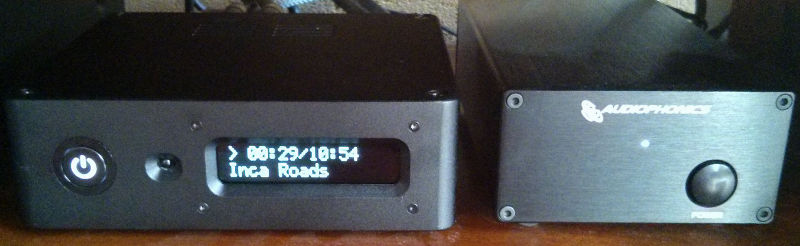
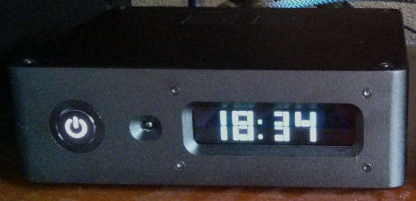

# Description
**RaspDAC on OSMC** is an how-to and a set of scripts to help people get their
Audiophonics' RaspDAC up and running with the [Open Source Media Center](https://osmc.tv/)
operating system.

The [RaspDAC](https://www.youtube.com/watch?v=HsJU91o_yHw) is a high quality
yet affordable network audio player. It is built on a Raspberry Pi 2 or 3 board,
a Sabre ES9023 based DAC, a power management unit and a LCD. Being an affordable
device, you are supposed to install the OS yourself.

The product page refers to a pre-configured version of RuneAudio, but the link
was broken when I checked, so I had to start from scratch. After the OS
installation, you have things to configure such as choosing an overaly to use
the DAC, and figuring out how to handle the power management unit and the display.
@dhrone wrote a [very helpfull project](https://github.com/dhrone/Raspdac-Display)
to describe how to install the RaspDAC on audio oriented distributions such as
Volumio and RuneAudio. These instructions helped me a lot understand how the
RaspDAC could be supported.

Of course I wanted to play my audio collection, but I though: it would be great
if the device could play videos too. So, I searched for an active distribution
that supported the Raspeberry Pi with a special on multimedia, hence OSMC. If
the audio capabilities of Kodi were not that good, I would install mpd and find
a way to switch between Kodi and mpd when necessary.

Kodi uses LCDproc to write on a LCD. This is a different approach from the one
described in [RaspDAC-Display](https://github.com/dhrone/Raspdac-Display) and
that's the reason why I decided to write my own how-to.

#### RaspDAC running OSMC playing music

<br/>
#### RaspDAC running OSMC in energy saving mode


Note: in no way am I affiliated to Audiophonics. I wanted to share my experience
in the hope that it would be helpfull. If you want to try this, proceed with
caution and at your own risk.

# Software installation
This project is dedicated to the software installation of the RaspDAC on OSMC.
If you're looking for instructions on how to assemble the hardware, refer to the
links at the end of this document (coming soon).

## Prepare the SD Card
The download page for OSMC is [here](https://osmc.tv/download/).
As of June 2017, there is no specific image for the Rapsberry Pi 3, so use the one
for the Raspberry Pi 2.

### Option 1: installer
OSMC proposes a dedicated program targetting the OS from which you will install
OSMC. If you wish to follow this path, click on your installation host OS and
follow the instructions. I never used the installer.

When you're done, insert the SDCard into the Rapsberry Pi and start the Pi.
Continue to the [Configuration section below](#configure_osmc).


### Option 2: manual installation
I assume you use a Unix-like operating system.
1. Download the compressed image: click the **Disk images** button and scroll down
to the latest release for Raspeberry Pi 2/3.

2. Extract the image:
cd to the directory where you downloaded the compressed image and issue the
following command:
```
$ gunzip OSMC_TGT_rbp2_20170615.img.gz
```

3. Prepare the SDCard: insert the SDCard in your installation host and figure
out which device it is associated to.
If the OS auto-mounted the partitions, unmount them. E.g.:
```
$ unmount /dev/sdb1
$ unmount /dev/sdb2
```
Copy the image to the SDCard. **Warning**: this will erase everything on the
SDCard. Make sure the device matches the SDCard before proceeding with the
following command:
```
$ sudo dd bs=4M if=OSMC_TGT_rbp2_20170615.img of=/dev/sdb
```

4. Finalize the installation: eject the SDCard from the installation host and
insert it into the Rapsberry Pi. Connect an ethernet link and a keyboard and
start the Pi.

OSMC will format and install the filesystem. When it's done, it will reboot.
Follow the instructions. Choose a name for your media center. When prompted for
SSH, accept the default (Enabled).


## <a name='configure_osmc'></a>Configure OSMC for the RaspDAC
You should now have a runing OSMC with the main menu and time of the day.

**Note**: don't worry about the blinking power button, we'll get to that in a
[dedicated section](#power_unit).

### Update OSMC
Before doing anything, it is a good idea to check for updates.
1. From the main menu, select **My OSMC**
2. Move up to the cloud **Updates**
3. Move down to **Manual Controls**
4. Move right to **Scan for updates now** and press the enter key.
5. Wait until the scan is done. Reboot if needed, otherwise you can press the
backspace key to return to the main menu.

### Configure the overlay for the RaspDAC
1. From the main menu, select **My OSMC**
2. Move left to **Pi Config**
3. Move down to **Hardware Support**
4. Move right and change **Soundcard Overlay** to **hifiberry-dac-overlay**
5. Move down and select **OK**
6. Press the backspace key to return to the main menu.
7. Move down to **Power**
8. Move down to **Reboot** and press the enter key.

If your RaspDAC is connected to an amplifier, you should get notification sounds
from Kodi when you move through the menus.

### Configure the installation host to connect to your RaspDAC
First you need to figure out which IP address the Raspberry Pi. There are multiple
ways of doing this depending on your network infrastructure. You may try
something like this:
```
$ arp -a
```
In the rest of this section, I will use the IP address 192.168.0.15.

**Note:** it is a good idea to assign a static address to the RaspDAC.

Get the ssh id from the RaspDAC (enter 'osmc' when prompted for the password):
```
$ ssh-copy-id osmc@192.168.0.15
```
Log in:
```
$ ssh osmc@192.168.0.15
$ uname -a
```
You should read someting like this:
```
Linux raspdac 4.9.29-5-osmc #1 SMP PREEMPT Tue Jun 6 18:23:42 UTC 2017 armv7l GNU/Linux
```

For security reasons, you should change the password:
```
$ sudo passwd
```

After you log out, just issue the following command to connect to the RaspDAC:
```
$ ssh osmc@192.168.0.15
```

### Download this project
For the rest of the installation, we will use files from various git projects.
On the RaspDAC, in an ssh session (see above), install git:
```
$ sudo apt-get install git-core
```

Clone this project:
```
$ mkdir ~/Projects
$ cd ~/Projects
$ git clone https://github.com/fengalin/raspdac-on-osmc
```

### <a name='power_unit'></a>Handle the Power Management Unit
The project contains scripts and a systemd unit to handle the power management
unit. This allows stopping the button from blinking when OSMC is started and handling
soft reboot or shutdowns as well as clean shutdown when the button is pressed.

The scripts rely on the python RPi.GPIO module which can be installed using pip
(we will also need gcc):
```
$ sudo apt-get install gcc python-dev python-pip
$ sudo pip install rpi.gpio
```

Install the scripts and the systemd unit:
```
$ sudo cp -r ~/Projects/raspdac-on-osmc/power/* /usr/local/
```
Register and start the service:
```
$ sudo systemctl enable raspdac
$ sudo systemctl start raspdac
```
After a few seconds, the power button should stop blinking. You can now press it
to cleanly shutdown the RaspDAC or manage the power from the command line
or from Kodi's user interface. E.g. to shutdown from the command line:
```
$ sudo systemctl poweroff
```

### <a name='lcd_display'></a>Configure the LCD
Kodi uses the [XBMC LCDproc add-on](http://kodi.wiki/view/Add-on:XBMC_LCDproc)
to show informations on a LCD display. Obviously, the add-on relies on a
properly configured [LCDproc](https://github.com/lcdproc/lcdproc) server.
LCDproc supports the OLED LCD HD44780 display that comes with the RaspDAC.
LCDproc gained support for the Raspeberry Pi 3 recently, so we need to get
a newer version (0.5.9) than the one provided by OSMC (0.5.7-2 as of today).

LCDproc generation requires automake:
```
$ sudo apt-get install automake make
```

Clone LCDproc:
```
$ cd ~/Projects
$ git clone https://github.com/lcdproc/lcdproc
```

Generate LCDproc with support for HD44780 only and install it:
```
$ cd ~/Projects/lcdproc
$ sh ./autogen.sh
$ ./configure --enable-drivers=hd44780 --disable-libusb --disable-libusb-1-0 --disable-libftdi --disable-libX11 --disable-libhid --disable-libpng --disable-freetype --disable-ethlcd
$ make
$ sudo make install
```

I stripped the configuration and adapted it to use the LCD via the GPIO.
I also wrote a systemd unit in order to start the daemon automatically.
Install the scripts and the systemd unit:
```
$ sudo cp -r ~/Projects/raspdac-on-osmc/lcd/* /usr/local/
```
**Important**: the default configuration is configured for the Sabre V3 version.
If you use a V2, proceed as follow (otherwise you can skip to [register the
service](#lcd_service)):
```
$ sudo nano /usr/local/etc/LCDd.conf
```
replace the following line:
```
pin_D7=27
```
with
```
pin_D7=15
```

<a name='lcd_service'></a>Register and start the service:
```
$ sudo systemctl enable LCDd
$ sudo systemctl start LCDd
```
You should see a welcome message on the LCD display.

Install the Kodi add-on to use LCDproc:
1. From Kodi's main menu, move to **Settings** -> **Add-on browser** ->
**Search**
2. Enter **LCDproc**.
3. Select **Services - XBMC LCDproc**, then **install**
The LCD display should show "XBMC running..." and the time and date.


### Configure an Infrared Remote Control
*Coming soon...*

# Tips
## Modify how things are displayed
Kodi stores a definition of the screens to display depending on the context in
the following file:
```
$ nano ~/.kodi/userdata/LCD.xml
```

If you want the display to scroll long lines slower or faster, you can adjust
the **FrameInterval** in the LCDd configuration:
```
$ sudo nano /usr/local/etc/LCDd.conf
```
Of course there are other parameters like the strings **Hello** and **GoodBye**
which are displayed when the server starts and stops.

## Use a mobile device interface to control the media center
Kodi has a builtin web server that allows manging some of its features from
a browser or a dedicated mobile device application: Kore.

These are the steps to configure the web server:
1. From Kodi's main menu, move to **Settings** -> **Services** ->
**Control**
2. Enter a **user name** and **password**
3. Allow **remote control**...

Check that the web server is runing: open a browser and connect to this URL:
http://192.168.0.15:8080/ (replace '192.168.0.15' with the IP of your RaspDAC).
You should be prompted with a user and password. Enter the ones you defined above.

If the connection succeeded, try installing Kore and configure it with the same
settings you used above.

Kore hosts a copy of the metadata from your media center. You can browse your
collection and control playlists, etc.


# Links
*Coming soon...*
